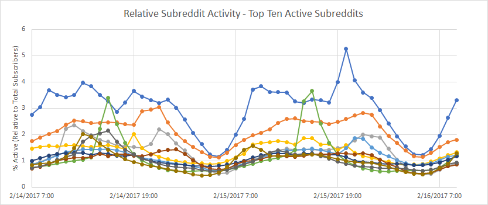

# Subreddit Stats

A project to gather activity statistics over time of given subreddits and gather them into a sqlite database. 

Utilizes a JSON Rest API that will be spun off as it's own project in the near future.

(Also my first node.js project...)

_Note: Subreddit names have been removed for anominity._

## Requirements

 - sqlite3

## Project Status

Code is functional and there are no known issues. Still undergoing active development as of February 2017.

## Installation

 - [Register a CLI app with reddit](https://www.reddit.com/prefs/apps/) for a secret token (recommend creating an alternative account for this).
 - [Install node.js](https://nodejs.org/en/download/).
 - Download or git clone this project.
 - [Install sqlite3 via npm](https://www.npmjs.com/package/sqlite3).
 - Create a settings.json file (cp settings_sample.json settings.json).
 - Edit settings.json file with your details.